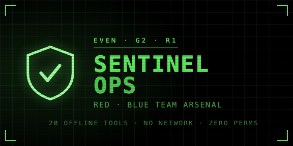
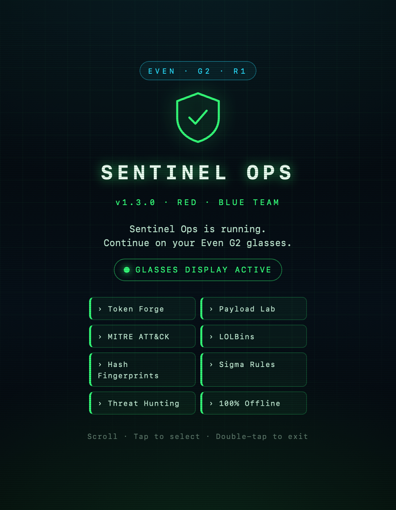

# Sentinel Ops — IT Security Toolkit for Even G2

A futuristic, **fully offline** IT security toolkit for Even Realities G2 smart glasses and the R1 ring. Eight pro tools on a heads-up display — no network, no permissions.

## Screenshots

| View | Preview |
|------|---------|
| [Cover](#) |  |
| [Main menu](#) |  |
| [Password Forge](#) |  |
| [Subnet Calculator](#) |  |
| [Port Reference](#) |  |
| [Phone companion](#) |  |


## Tools

| Tool | What it does |
|------|--------------|
| **Password Forge** | CSPRNG passwords (12–32 chars), entropy + strength rating |
| **Passphrase** | Diceware-style memorable passphrases |
| **Subnet Calculator** | CIDR /8–/30 — mask, wildcard, network, broadcast, host range |
| **Port Reference** | Common ports by category with risk flags |
| **Hardening Checklist** | CIS-style quick wins |
| **Incident Response** | NIST SP 800-61 phases with concrete actions |
| **NATO Phonetic** | Full alphabet + digits |
| **How to Use** | On-glass control reference |

## Run

Requires **Node.js 20+**.

### Linux / macOS

```bash
git clone <your-repo-url>
cd sentinel-ops-g2
npm install
npm run dev          # http://localhost:5173
npm run simulate     # Even Hub simulator
npm run build
npm run pack         # → sentinel-ops.ehpk
npm run capture-media
npm run icons
```

### Windows

```powershell
git clone <your-repo-url>
cd sentinel-ops-g2
npm install
npm run dev
npm run simulate
npm run pack
```

## Controls

- **Scroll** the bottom menu with temple touchpad or R1 ring
- **Tap** to select; tap HUD to re-run current tool
- **Double-tap** to exit

See [SUBMISSION.md](SUBMISSION.md) for Even Hub store listing and upload steps.
